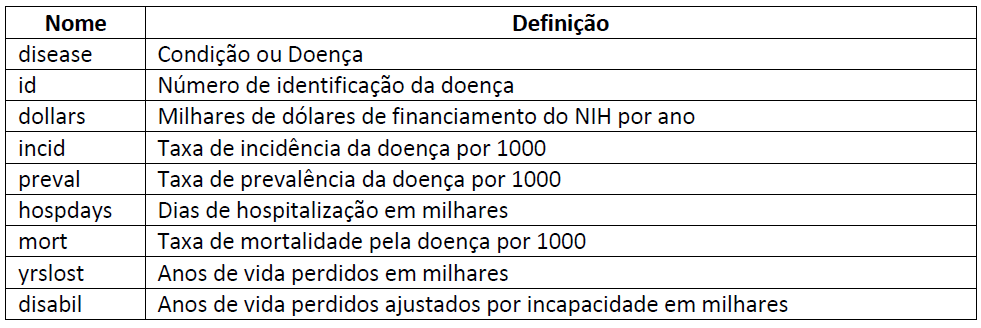

As questões a seguir referem-se ao estudo de Gross et al (1999) sobre a relação entre financiamento pelo National Institutes of Health e carga de 29 doenças. Os dados da Tabela 1 desde estudo estão no arquivo 3.ex.Funding.sav. Os nomes das variáveis e definições neste arquivo são:




```{r preparing_R, message=FALSE, warning=FALSE}

# install.packages("haven")
# install.packages("ggplot2")
#install.packages("RColorBrewer")
#install.packages("ellipse")
#install.packages("car")
#install.packages("faraway")

library("haven")
library("ggplot2")
#library("compareGroups")
library("tidyverse")
library("RColorBrewer")
library("ellipse")
library("car")
library("mctest")
library("faraway")
library (MASS)
```


```{r dados}
dados <- read_spss(file = "3.ex.Funding.sav")

```

1. 

__a) Explore a relação entre dollars e as outras variáveis independentes (exceto disease e id).__ 


Verificando a correlação entre as variáveis:

```{r correlation_var_outcome}

#Crio um objeto com as variáveis que quero correlacionar
my_data <- dados[,c("dollars", "incid", "preval", "mort", "hospdays", "yrslost", "disabil")]

#aplico a função de correlação, ignorando os valores missing (complete.obs)
cor_matrix <- cor(my_data, use = "complete.obs")

#arredondo para duas casas decimais
round(cor_matrix,2)
```

Observamos que, em geral, as variáveis estão fracamente correlacionadas com o desfecho. A exceção é yrlost, que está um pouco mais correlacionada.

```{r correlation_plot}
#Painel de 100 cores e matriz de correlação ordenada

my_colors <- brewer.pal(5, "Spectral")
my_colors <- colorRampPalette(my_colors)(100)

ord <- order (cor_matrix[1, ])
cor_matrix_ord <- cor_matrix[ord, ord]

plotcorr(cor_matrix_ord, col = my_colors[cor_matrix_ord*50+50], mar = c(1, 1, 1, 1))

```

Na matriz de correlação acima, quanto mais "estreita" (em elipse) a esfera e mais próximo de verde-escuro, maior a correlação.

Abaixo, regressões lineares simples entre o desfecho e cada um dos preditores.

####Incid x dollars

```{r lm_dol_incid}

lm_dol_incid <- lm(formula = dollars ~ incid,
                    data = dados)

summary(lm_dol_incid)


```

```{r scat_dol_incid}

scat_dol_incid <- ggplot(dados, aes(x = incid, y = dollars)) +
                                 geom_point() +
                                 geom_smooth(method = "lm") +
                                 scale_x_continuous("Incidence per 1000") +
                                 scale_y_continuous("thousands of NIH research dollars") +
                                 theme_minimal() +
  labs(title = paste("Adj R2 = ",signif(summary(lm_dol_incid)$adj.r.squared, 5),
                         "Intercept =",signif(lm_dol_incid$coef[[1]],5 ),
                         " Slope =",signif(lm_dol_incid$coef[[2]], 5),
                         " p =",signif(summary(lm_dol_incid)$coef[2,4], 5)))

scat_dol_incid
```

####Preval x dollars

```{r lm_dol_preval}

lm_dol_preval <- lm(formula = dollars ~ preval,
                    data = dados)

summary(lm_dol_preval)


```

```{r scat_dol_preval}

scat_dol_preval <- ggplot(dados, aes(x = incid, y = dollars)) +
                                 geom_point() +
                                 geom_smooth(method = "lm") +
                                 scale_x_continuous("Incidence per 1000") +
                                 scale_y_continuous("thousands of NIH research dollars") +
                                 theme_minimal() +
  labs(title = paste("Adj R2 = ",signif(summary(lm_dol_preval)$adj.r.squared, 5),
                         "Intercept =",signif(lm_dol_preval$coef[[1]],5 ),
                         " Slope =",signif(lm_dol_preval$coef[[2]], 5),
                         " p =",signif(summary(lm_dol_preval)$coef[2,4], 5)))

scat_dol_preval

```

####Mort x dollars

```{r lm_dol_mort}

lm_dol_mort <- lm(formula = dollars ~ mort,
                    data = dados)

summary(lm_dol_mort)


```

```{r scat_dol_mort}

scat_dol_mort <- ggplot(dados, aes(x = mort, y = dollars)) +
                                 geom_point() +
                                 geom_smooth(method = "lm") +
                                 scale_x_continuous("Mortality per 1000") +
                                 scale_y_continuous("thousands of NIH research dollars") +
                                 theme_minimal() +
  labs(title = paste("Adj R2 = ",signif(summary(lm_dol_mort)$adj.r.squared, 5),
                         "Intercept =",signif(lm_dol_mort$coef[[1]],5 ),
                         " Slope =",signif(lm_dol_mort$coef[[2]], 5),
                         " p =",signif(summary(lm_dol_mort)$coef[2,4], 5)))

scat_dol_mort


```

####Hospdays x dollars

```{r lm_dol_hospdays}

lm_dol_hospdays <- lm(formula = dollars ~ hospdays,
                    data = dados)

summary(lm_dol_hospdays)

```

```{r scat_dol_hospdays}

scat_dol_hospdays <- ggplot(dados, aes(x = hospdays, y = dollars)) +
                                 geom_point() +
                                 geom_smooth(method = "lm") +
                                 scale_x_continuous("Thousands of hospital days") +
                                 scale_y_continuous("thousands of NIH research dollars") +
                                 theme_minimal() +
  labs(title = paste("Adj R2 = ",signif(summary(lm_dol_hospdays)$adj.r.squared, 5),
                         "Intercept =",signif(lm_dol_hospdays$coef[[1]],5 ),
                         " Slope =",signif(lm_dol_hospdays$coef[[2]], 5),
                         " p =",signif(summary(lm_dol_hospdays)$coef[2,4], 5)))

scat_dol_hospdays


```

####Yrslost x dollars

```{r lm_dol_yrslost}

lm_dol_yrslost <- lm(formula = dollars ~ yrslost,
                    data = dados)

summary(lm_dol_yrslost)

```

```{r scat_dol_yrslost}

scat_dol_yrslost <- ggplot(dados, aes(x = yrslost, y = dollars)) +
                                 geom_point() +
                                 geom_smooth(method = "lm") +
                                 scale_x_continuous("Thousands of years of life lost") +
                                 scale_y_continuous("thousands of NIH research dollars") +
                                 theme_minimal() +
  labs(title = paste("Adj R2 = ",signif(summary(lm_dol_yrslost)$adj.r.squared, 5),
                         "Intercept =",signif(lm_dol_yrslost$coef[[1]],5 ),
                         " Slope =",signif(lm_dol_yrslost$coef[[2]], 5),
                         " p =",signif(summary(lm_dol_yrslost)$coef[2,4], 5)))

scat_dol_yrslost


```

####Disabil x dollars

```{r lm_dol_disabil}

lm_dol_disabil <- lm(formula = dollars ~ disabil,
                    data = dados)

summary(lm_dol_disabil)

```

```{r scat_dol_disabil}

scat_dol_disabil <- ggplot(dados, aes(x = disabil, y = dollars)) +
                                 geom_point() +
                                 geom_smooth(method = "lm") +
                                 scale_x_continuous("Thousands of disability-adjusted life years") +
                                 scale_y_continuous("thousands of NIH research dollars") +
                                 theme_minimal() +
  labs(title = paste("Adj R2 = ",signif(summary(lm_dol_disabil)$adj.r.squared, 5),
                         "Intercept =",signif(lm_dol_disabil$coef[[1]],5 ),
                         " Slope =",signif(lm_dol_disabil$coef[[2]], 5),
                         " p =",signif(summary(lm_dol_disabil)$coef[2,4], 5)))

scat_dol_disabil

```


__b) Construa manualmente um modelo que você julga que melhor explica o desfecho.__ 

O objetivo do nosso modelo é explicar quais características estão relacionadas com o investimento dado às doenças pelo NIH.
 
As variáveis preditoras candidatas estão relacionadas a:
* 1) quantidade de pessoas acometidas pela doença: prevalência, incidência
* 2) morbidade da doença: yrslost, mortality
* 3) mortalidade da doença: disability, hospdays

Os 3 aspectos, segundo nossa hipótese, poderiam razões que levassem a investimentos maiores em pesquisa (o desfecho) para uma dada doença.

Um obstáculo é que muitas das variáveis preditoras estão altamente correlacionadas entre si, de modo que não parece apropriado incluir todas no mesmo modelo. 
Além disso, outro problema que temos é a ausência de certas informações do banco, faltando dados sobre prevalência e incidência para algumas doenças. Assim, o modelo estimado pode não ser válido para elas.

Nosso intuito é estimar o modelo que melhor explique o desfecho contendo um preditor de cada grupo (quantidade, mortalidade e morbidade).

Prevalência e incidência não apresentaram alta correlação com nenhum dos outros preditores, mas é possível que isso esteja mascarado pelos dados missing.
As variáveis dos grupos "morte" e "morbidade" de menor correlação são yrslost e disabil.
Modelo 1: yrslost + disabil + preval
Modelo 2: yrslost + disabil + incid

Como sabemos que disabil inclui yrslost, poderíamos comparar yrslost com seu complementar, YLD (disabil - yrslost)

Modelo 3a: yrslost + YLD + preval
Modelo 3b: yrslost + YLD + incid


Métodos backward, forward e stepwise não parecem adequados, devido à alta correlação entre os preditores, indicando colinearidade.

Modelo 1:

```{r modelo1}

modelo1 <- lm(formula = dollars ~ preval + yrslost + disabil,
                    data = dados)

summary(modelo1)

```

VIF modelo 1: 

```{r modelo1_vif}

vif(modelo1)

```

No modelo 1, nenhum dos preditores se encontra significativamente associado ao desfecho, apesar do VIF para cada um dos preditores não ser alto.

Modelo 2:
```{r modelo2}

modelo2 <- lm(formula = dollars ~ incid + yrslost + disabil,
                    data = dados)

summary(modelo2)

```

VIF modelo 2:

```{r modelo2_vif}

vif(modelo2)

```

No modelo 2, nenhum dos preditores se encontra significativamente associado ao desfecho, apesar do VIF para cada um dos preditores não ser alto.


Modelo 3a:
```{r modelo3a}
dados$YLD <- dados$disabil - dados$yrslost

modelo3a <- lm(formula = dollars ~ preval + yrslost + YLD,
                    data = dados)

summary(modelo3a)

```

Modelo 3b:

```{r modelo3b}
dados$YLD <- dados$disabil - dados$yrslost

modelo3b <- lm(formula = dollars ~ incid + yrslost + YLD,
                    data = dados)

summary(modelo3b)

```

Nos modelos 3a e 3b, também não foi encontrada significância estatística entre os preditores e o desfecho. 

__c) Faça o gráfico dos valores preditos versus os resíduos studentizados. Interprete os resultados.__


```{r residuos_student_hist}

sres <- studres(modelo1)

hist(sres, freq=FALSE, 
   main="Distribution of Studentized Residuals")


```
```{r residuos_student_2}

spreadLevelPlot(modelo1)

```

São poucos pontos no gráfico, mas parece que a suposição de homogeneidade de variância do desfecho não foi violada.


2. 

__a. Transforme todas as variáveis utilizadas na questão 1 em logaritmo natural. Utilize o método stepwise para selecionar os preditores.__


Começo pelo preditor de maior significância estatística, yrslost

```{r stepwise_mrm_1}

#começo pelo preditor de maior significância estatística, yrslost

stepwise_mrm_1 <- lm(data = dados, formula = (log(dollars) ~ log(yrslost)))
  

summary(stepwise_mrm_1)
```

Adiciono disabil

```{r stepwise_mrm_2}

#adiciono disabil

stepwise_mrm_2 <- lm(data = dados, formula = (log(dollars) ~ log(yrslost) + log(disabil)))
  

summary(stepwise_mrm_2)
```

Testo incid

```{r stepwise_mrm_3}

#troco disabil por incid

stepwise_mrm_3 <- lm(data = dados, formula = (log(dollars) ~ log(yrslost) + log(incid)))
  

summary(stepwise_mrm_3)
```

Testo mort

```{r stepwise_mrm_4}

#mort

stepwise_mrm_4 <- lm(data = dados, formula = (log(dollars) ~ log(yrslost) + log(mort)))
  

summary(stepwise_mrm_4)
```

Testo hospdays

```{r stepwise_mrm_5}

#hospdays

stepwise_mrm_5 <- lm(data = dados, formula = (log(dollars) ~ log(yrslost) + log(hospdays)))
  

summary(stepwise_mrm_5)
```

Testo preval. Mantenho esse, por dar a maior explicação ao desfecho

```{r stepwise_mrm_6}

#preval
#mantenho esse, por dar a maior explicação ao desfecho

stepwise_mrm_6 <- lm(data = dados, formula = (log(dollars) ~ log(yrslost) + log(preval))
  

summary(stepwise_mrm_6)

```

Incluo ao modelo a segunda melhor explicativa, hospdays

```{r stepwise_mrm_7}

#incluir segunda melhor explicativa, hospdays

stepwise_mrm_7 <- lm(data = dados, formula = (dollars ~ log(yrslost) + log(preval) + log(hospdays)))
  

summary(stepwise_mrm_7)
```


__b. Faça um resumo dos passos que o algoritmo tomou.__

O modelo foi iniciado pelo preditor de maior significância estatística, yrslost. Em seguida, foi testada a explicação do desfecho em modelo com esse preditor e cada um dos outros, escolhendo o de maior R2 ajustado (yrslost + preval). Como permaneceram no modelo um preditor da categoria "morte" e outro da categoria "proporção de casos na população", resta apenas um que indique "morbidade". Para isso, escolho hospdays, que traz boa explicação ao modelo.


__c. Faça o gráfico dos valores preditos versus os resíduos studentizados para o modelo final.__

```{r stepwise_predicted_studentized}
  
spreadLevelPlot(stepwise_mrm_7)
```


__d. Compare com a resposta da questão 1.__

O modelo com log apresenta uma variável significativamente associada ao desfecho, além de apresentar melhor ajuste.


3. Para o modelo final da questão 2, faça o diagnóstico completo avaliando as suposições sobre os resíduos, multicolinearidade e observações influentes. Interprete os resultados.

```{r resíduos}

plot(stepwise_mrm_7)

```

Gráfico 1: avalia a suposição de homogeneidade de variância do desfecho. O esperado seria ver uma nuvem simetricamente espalhada ao longo do eixo zero, sem padrão. No entanto, não é o que o gráfico aparenta. Assim, acreditamos que essa suposição possa estar sendo violada.

Gráfico 2: QQ-plot para avaliar suposição de que os resíduos seguem uma distribuição normal.
Observando o gráfico, parece que a maioria dos pontos estão próximos da reta, com exceção dos pontos próximos das caudas.

Gráfico 4: observações influentes. Difícil interpretação.

```{r resíduos_vif}

vif(stepwise_mrm_7)

```

Multicolinearidade aparentemente pouco preocupante analisando o vif de cada um dos preditores.


__4. Faça a regressão entre log(dollars) versus log(disabil) e log(hospdays). Interprete os resultados.__

```{r mrm_log}

mrm_log <- lm(data = dados, formula = (log(dollars) ~ log(disabil) + log(hospdays)))
  

summary(mrm_log)

confint(mrm_log)
```

Segundo o modelo apresentado, a cada variação de um ponto no log de disabil, ocorre aumento de 0.90 (IC = 0.6-1.21) no log de dollars e a cada aumento de um ponto no log de hospdays ocorre uma diminuição de 0,52 (IC = -0.81 a -0.0225) log de dollars. 

5. 
__a.Utilizando o modelo da questão 4, qual é a estimativa da quantidade média de fundos de pesquisa orçados para doenças que causam 1 milhão de dias de hospitalização em um ano e a perda de 1 milhão de anos de vida ajustados por incapacida de?Calcule o intervalo de 95% de confiança para este valor__

```{r coef_q4}

coef(mrm_log)
```

__Fundos = 8.74 + 0.91 Disab - 0.52 HospDays__

```{r confidence_interval}

newdata <- data.frame(disabil = 100000,
                      hospdays = 100000)

predict(mrm_log, newdata, interval = "confidence")
```


Média de R$ 13,21 (em milhares), ou seja, 13.210 dólares, com IC de 12.269 a 14.154.


__b.Também calcule o IC 95% para um financiamento que seria fornecido a uma nova doença que causa 1 milhão de dias de hospitalização em um ano e a perda de 1 milhão de anos de vida ajustados por incapacidade.__


```{r prediction_interval}

predict(mrm_log, newdata, interval = "prediction")
```

6. Crie uma variável dummy que assume valor 1 se hospdays >= 1000 e 0 caso contrário. Faça a regressão entre log(dollars) versus log(disabil) e a variável dummy. Interprete os resultados, escrevendo as equações para cada categoria da variável dummy. Teste se é necessário incluir uma interação no modelo.

```{r dummy_hospdays}

dados$dummy_hospdays <- ifelse(dados$hospdays >= 1000, 1,
                               ifelse(is.na(dados$hospdays), NA,0))

```

```{r model_dummy_hospdays}

mod_dummy_hospdays <- lm(data = dados, formula = (log(dollars) ~ log(disabil) + dummy_hospdays))

summary(mod_dummy_hospdays)
```

```{r hist res model_dummy}
dummy_res <- studres(mod_dummy_hospdays)

hist(dummy_res, freq=FALSE, 
   main="Distribution of Studentized Residuals")
```

```{r qq res model_dummy}
qqPlot(dummy_res)
```


```{r student res model_dummy}

spreadLevelPlot(mod_dummy_hospdays)

```

```{r confint_dummy}

confint(mod_dummy_hospdays)

```


O modelo que inclui a variável dummy explica 65% da variabilidade de log de dollars, sendo que a cada aumento de 1 ponto de log de disabil ocorre aumento de 0.77 (IC 0.54 a 0.99) log de dollars, e para doenças que gerem a partir de 1000 dias de internação, o investimento em pesquisa cai 1.40 (IC -2.07 a -0.73)log de dollars.


